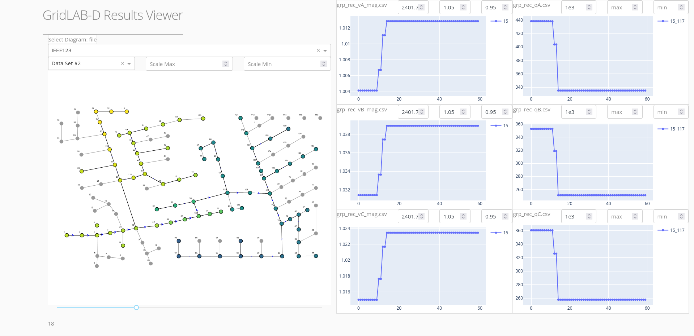

# GridLAB-D Results Viewer

## About this app

This app is designed to show results from a modified 3-phase IEEE123 bus system. 
In the future it will be generalized to be more flexible. 

## How to run this app

To run this app first clone repository and then open a terminal to the app folder.

```
git clone https://github.com/nathantgray/ResultsViewer.git
cd ResultsViewer
```

Create and activate a new virtual environment (recommended) by running
the following:

On Windows

```
virtualenv venv 
\venv\scripts\activate
```

Or if using linux

```bash
python3 -m venv myvenv
source myvenv/bin/activate
```

Install the requirements:

```
pip install -r requirements.txt
```
Run the app:

```
python app.py
```
You can run the app on your browser at http://127.0.0.1:8050


## Screenshots



## Resources

To learn more about Dash, please visit [documentation](https://plot.ly/dash).
